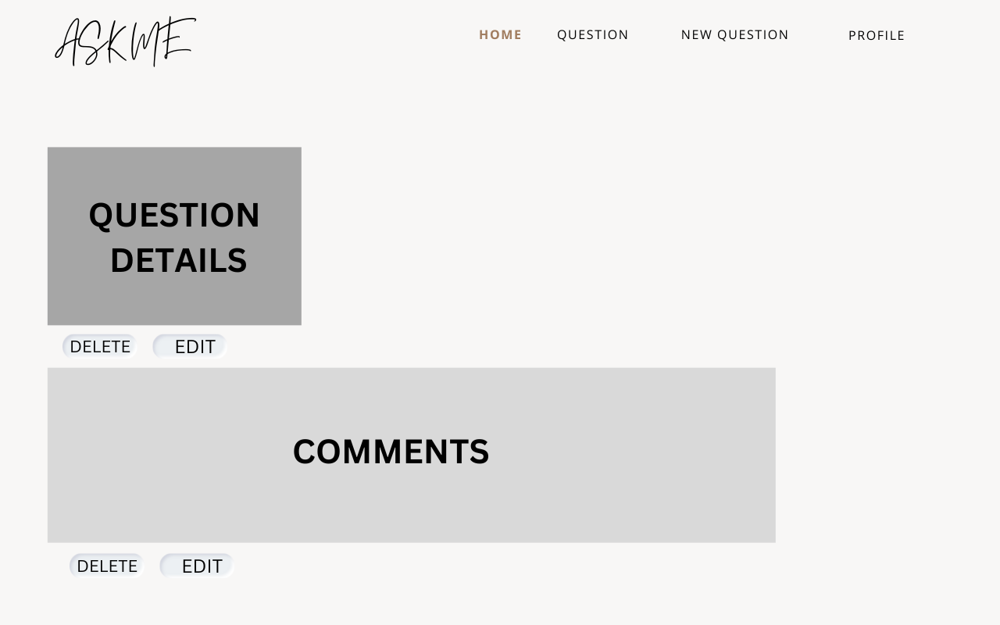
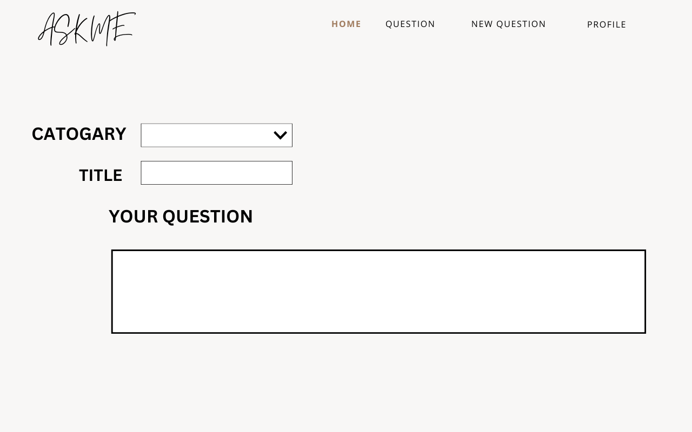

# Open Platform for Questions and Answers

An open platform for everyone where users can post questions or problems they face and seek answers or solutions from others. Users can publish their inquiries by selecting the type of problem or question.

## Description
An open platform for everyone where users can post questions or problems they face and seek answers or solutions from others. Users can publish their inquiries by selecting the type of problem or question.

---

## User Stories
- **As a new user**, I want to sign up using my email and password, so that I can create an account to interact with the platform.
- **As a registered user**, I want to sign in using my email and password, so that I can access my account.
- **As a logged-in user**, I want to:
  - Post a question with a title, description, and tags.
  - Edit my posted question to correct errors or add more information.
  - Delete my question if necessary.
  - Add an answer to a question.
  - Edit my answer to fix errors or provide better explanations.
  - Delete my answer if it’s no longer relevant or appropriate.
  - Add a comment to a question or answer.
  - Edit my comment to fix mistakes or clarify my input.
  - Delete my comment to remove unwanted content.
  - View questions categorised by tags to easily find topics of interest.
  - Like answers so others can know which answers are preferred.

---

## Data Models

---

## Wireframes
### 1. Home Page

### 2. Questions Page

### 3. Question Details Page

### 4. User Dashboard

---

## Pseudocode

### Signing Up
1. User provides email and password.
2. Validate email format and password strength.
3. Create a new user account in the database.
4. Confirm the account creation.

### Signing In
1. User provides email and password.
2. Check credentials against the database.
3. Create a session for the user.
4. Confirm login success.

### Posting a Question
1. Check if the user is logged in.
2. Accept title, description, and tags.
3. Save the question to the database, linked to the user ID.
4. Confirm successful posting.

### Editing a Question
1. Verify user ownership of the question.
2. Accept updated details.
3. Update the question in the database.
4. Confirm successful update or return an error if unauthorized.

### Deleting a Question
1. Verify user ownership of the question.
2. Remove the question from the database.
3. Confirm deletion or return an error if unauthorized.

### Adding an Answer
1. Check if the user is logged in.
2. Accept the answer content.
3. Save the answer to the database, linked to the question and user IDs.
4. Confirm successful addition.

### Editing an Answer
1. Verify user ownership of the answer.
2. Accept updated content.
3. Update the answer in the database.
4. Confirm successful update or return an error if unauthorized.

### Deleting an Answer
1. Verify user ownership of the answer.
2. Remove the answer from the database.
3. Confirm deletion or return an error if unauthorized.

### Adding a Comment
1. Check if the user is logged in.
2. Accept the comment content.
3. Save the comment to the database, linked to the relevant question/answer and user IDs.
4. Confirm successful addition.

### Editing a Comment
1. Verify user ownership of the comment.
2. Accept updated content.
3. Update the comment in the database.
4. Confirm successful update or return an error if unauthorized.

### Deleting a Comment
1. Verify user ownership of the comment.
2. Remove the comment from the database.
3. Confirm deletion or return an error if unauthorized.

